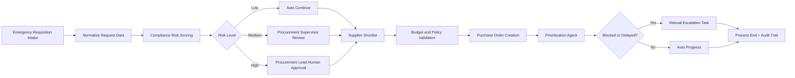

# Architecture

## Overview
CrisisProcure AI is orchestrated by UiPath Maestro BPMN on UiPath Automation Cloud.

### Core components
- Maestro BPMN process: controls sequence, branching, retries, and approvals
- RPA/API tasks: ingest requisitions and perform ERP-side actions
- Compliance-Risk Agent API: classifies policy and budget risk, then routes decisions
- Prioritization Agent API: ranks pending emergency requests and recommends action
- Human tasks: procurement lead approval and policy override ownership

## Logical flow

## Resilience design
- External API retries with backoff (3 attempts)
- Timeout branches to manual queue
- Unrecoverable failure path creates incident case
- Audit trail retained for approvals and overrides

## Security and governance notes
- Store API credentials in UiPath assets or secure connection manager
- Do not hardcode secrets in workflow files
- Keep human approvals mandatory for high-risk actions

## Evidence to capture for judges
- One successful happy path run
- One high-risk path with explicit human approval
- Escalation path showing manual unblock routing
- Logs that show orchestration and handoff boundaries
